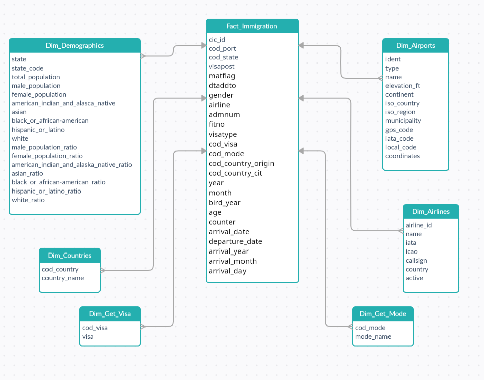

# Data Engineering Capstone Project #
## Overview ##
The purpose of the data engineering capstone project is to give you a chance to combine what you've learned throughout the program. This project will be an important part of your portfolio that will help you achieve your data engineering-related career goals.

In this project, you can choose to complete the project provided for you, or define the scope and data for a project of your own design. Either way, you'll be expected to go through the same steps outlined below.

### Udacity Provided Project ###
In the Udacity provided project, you'll work with four datasets to complete the project. The main dataset will include data on immigration to the United States, and supplementary datasets will include data on airport codes, U.S. city demographics, and temperature data. You're also welcome to enrich the project with additional data if you'd like to set your project apart.

## Instructions ##
To help guide your project, we've broken it down into a series of steps.

**Step 1:** Scope the Project and Gather Data
Since the scope of the project will be highly dependent on the data, these two things happen simultaneously. In this step, you’ll:

- Identify and gather the data you'll be using for your project (at least two sources and more than 1 million rows). See Project Resources for ideas of what data you can use.
- Explain what end use cases you'd like to prepare the data for (e.g., analytics table, app back-end, source-of-truth database, etc.)

**Step 2:** Explore and Assess the Data
- Explore the data to identify data quality issues, like missing values, duplicate data, etc.
- Document steps necessary to clean the data

**Step 3:** Define the Data Model
- Map out the conceptual data model and explain why you chose that model
- List the steps necessary to pipeline the data into the chosen data model

**Step 4:** Run ETL to Model the Data
- Create the data pipelines and the data model
- Include a data dictionary
- Run data quality checks to ensure the pipeline ran as expected
    - Integrity constraints on the relational database (e.g., unique key, data type, etc.)
    - Unit tests for the scripts to ensure they are doing the right thing
    - Source/count checks to ensure completeness
    
**Step 5:** Complete Project Write Up
- What's the goal? What queries will you want to run? How would Spark or Airflow be incorporated? Why did you choose the model you chose?
- Clearly state the rationale for the choice of tools and technologies for the project.
- Document the steps of the process.
- Propose how often the data should be updated and why.
- Post your write-up and final data model in a GitHub repo.
- Include a description of how you would approach the problem differently under the following scenarios:
    - If the data was increased by 100x.
    - If the pipelines were run on a daily basis by 7am.
    - If the database needed to be accessed by 100+ people.

# Immigration in USA
### Data Engineering Capstone Project

#### Project Summary
- The idea is to create a Data Warehouse to reflect the Immigration data in USA Airports

#### The project was divided into 5 steps:
* Step 1: Get Data from the directories
* Step 2: Explore the Data
* Step 3: Construct the data model
* Step 4: Model the data
* Step 5: Answare the question

## Strategy ##


# DEND Capstone

# **Data Dictionary Dimension Tables**
## Airports Data
 * ident: string (nullable = true) - Airport id
 * type: string (nullable = true) - size of airport
 * name: string (nullable = true) - name
 * elevation_ft: float (nullable = true) - elevation in feet
 * continent: string (nullable = true) - continet
 * iso_country: string (nullable = true) - country (ISO-2)
 * iso_region: string (nullable = true) - region (ISO-2)
 * municipality: string (nullable = true) - municipality
 * gps_code: string (nullable = true) - gps code
 * iata_code: string (nullable = true) - IATA code
 * local_code: string (nullable = true) - Local code
 * coordinates: string (nullable = true) - coordinates
 
## U.S. Demographic by State
 * State: string (nullable = true)-Full state name
 * state_code: string (nullable = true)- State code
 * Total_Population: double (nullable = true) - Total population of the state
 * Male_Population: double (nullable = true)- Total Male population per state
 * Female_Population: double (nullable = true)- Total Female population per state
 * American_Indian_and_Alaska_Native: long (nullable = true) - Total American Indian and Alaska Native population per state
 * Asian: long (nullable = true) - Total Asian population per state
 * Black_or_African-American: long (nullable = true) - Total Black or African-American population per state
 * Hispanic_or_Latino: long (nullable = true) - Total Hispanic or Latino population per state 
 * White: long (nullable = true) - Total White population per state 
 * Male_Population_Ratio: double (nullable = true) - Male population ratio per state
 * Female_Population_Ratio: double (nullable = true) - Female population ratio per state
 * American_Indian_and_Alaska_Native_Ratio: double (nullable = true) - Black or African-American population ratio per state
 * Asian_Ratio: double (nullable = true) - Asian population ratio per state
 * Black_or_African-American_Ratio: double (nullable = true) - Black or African-American population ratio per state
 * Hispanic_or_Latino_Ratio: double (nullable = true) - Hispanic or Latino population ratio per state 
 * White_Ratio: double (nullable = true) - White population ratio per state 
 
## Airlines
 * Airline_ID: integer (nullable = true) - Airline id
 * Name: string (nullable = true) -  Airline name
 * IATA: string (nullable = true) - IATA code
 * ICAO: string (nullable = true) - ICAO code
 * Callsign: string (nullable = true) - name code
 * Country: string (nullable = true) - country
 * Active: string (nullable = true) - Active

## Countries
 * cod_country: long (nullable = true) - Country code
 * country_name: string (nullable = true) - Country name
 

## Visas
 * cod_visa: string (nullable = true) - visa code
 * visa: string (nullable = true) - visa description
 
## Mode to access
 * cod_mode: integer (nullable = true) - Mode code
 * mode_name: string (nullable = true) - Mode description


# Fact Table (Inmigration Registry)
 * cic_id: integer (nullable = true) - CIC id
 * cod_port: string (nullable = true) - Airport code
 * cod_state: string (nullable = true) - US State code
 * visapost: string (nullable = true) - Department of State where where Visa was issued
 * matflag: string (nullable = true) - Match flag - Match of arrival and departure records
 * dtaddto: string (nullable = true) -  Character Date Field - Date to which admitted to U.S. (allowed to stay until)
 * gender: string (nullable = true) - Gender
 * airline: string (nullable = true) - Airline code
 * admnum: double (nullable = true) - Admission Number
 * fltno: string (nullable = true) - Flight number of Airline used to arrive in U.S.
 * visatype: string (nullable = true) - Class of admission legally admitting the non-immigrant to temporarily stay in U.S
 * cod_visa: integer (nullable = true) - Visa code
 * cod_mode: integer (nullable = true) - Mode code
 * cod_country_origin: integer (nullable = true) - Country of origin code
 * cod_country_cit: integer (nullable = true) - City code of origin
 * year: integer (nullable = true) - Year
 * month: integer (nullable = true) - Month
 * bird_year: integer (nullable = true) - Year of Birth
 * age: integer (nullable = true) - Age
 * counter: integer (nullable = true) - Used for summary statistics
 * arrival_date: date (nullable = true) - Arrival date
 * departure_date: date (nullable = true) - Departure Date
 * arrival_year: integer (nullable = true) - arrival year
 * arrival_month: integer (nullable = true) - Arrival month
 * arrival_day: integer (nullable = true) - arrival day of month
 
 # Example Code: #
 ```
from pyspark.sql import SparkSession
from pyspark.sql.types import StructType, StructField, StringType, IntegerType


class Source:
    """
    Get the sources and return dataframes
    """

    def __init__(self, spark, paths):
        self.spark = spark
        self.paths = paths

    def _get_standard_csv(self, filepath, delimiter=","):
        """
        Get sources in CSV format
        :param filepath: csv file path
        :param delimiter: delimiter
        :return: dataframe
        """
        return self.spark.read.format("csv").option("header", "true").option("delimiter", delimiter).load(filepath)

    def get_cities_demographics_raw(self):
        """
        Get demographics dataset
        :return: demographics dataset
        """
        return self._get_standard_csv(filepath=self.paths["demographics"], delimiter=";")

    def get_airports_raw(self):
        """
        Get airports dataset
        :return: airports dataset
        """
        return self._get_standard_csv(self.paths["airports"])

    def get_inmigration_raw(self):
        """
        Get inmigration dataset.
        :return: inmigration dataset
        """
        return self.spark.read.parquet(self.paths["sas_data"])

    def get_countries_raw(self):
        """
        Get countries dataset
        :return: countries dataset
        """
        return self.spark.read.option("mode", "DROPMALFORMED").option("header", "true").csv(self.paths["countries"], sep=";")
        #return self._get_standard_csv(self.paths["countries"], sep=";")

    def get_visa_raw(self):
        """
        Get visa dataset
        :return: visa dataset
        """
        return self._get_standard_csv(self.paths["visa"])

    def get_mode_raw(self):
        """
        Get modes dataset
        :return: modes dataset
        """
        return self._get_standard_csv(self.paths["mode"])

    def get_airlines(self):
        """
        Get airlines dataset
        :return: airlines dataset
        """
        schema = StructType([
            StructField("Airline_ID", IntegerType(), True),
            StructField("Name", StringType(), True),
            StructField("Alias", StringType(), True),
            StructField("IATA", StringType(), True),
            StructField("ICAO", StringType(), True),
            StructField("Callsign", StringType(), True),
            StructField("Country", StringType(), True),
            StructField("Active", StringType(), True)])

        return self.spark.read.csv(self.paths["airlines"], header=False, schema=schema)
```

